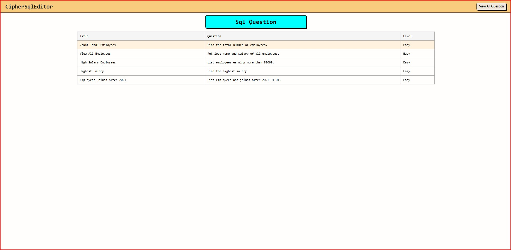
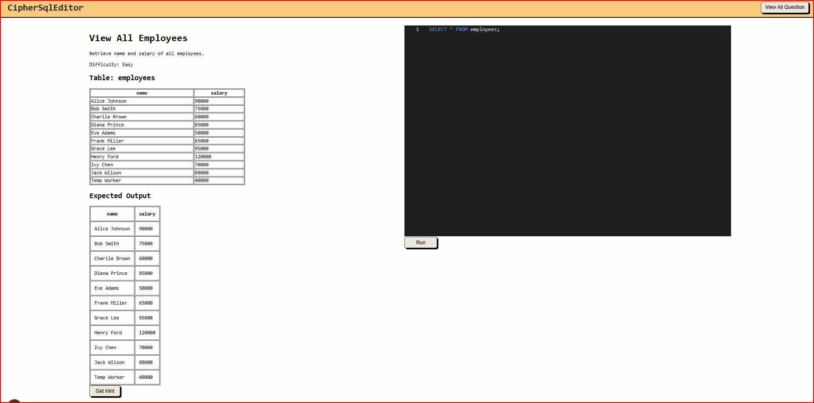

# CipherSqlStudio

### Folder Structure

```txt
CipherSQLStudio/
│
├── frontend/
│   ├── app/                # Next.js app router pages
│   ├── components/         # Reusable UI components (Editor, OutputPanel, etc.)
│   ├── styles/             # Raw CSS files
│   └── package.json
│
├── backend/
│   ├── controllers/        # Assignment execution & hint logic
│   ├── models/             # MongoDB models (Assignment, Attempt)
│   ├── routes/             # API routes
│   ├── utils/              # SQL validation & comparison helpers
│   ├── index.js            # Express server entry
│   └── package.json
|   └── .env.example
├── README.md
```

---

## ⚙️ Environment Variables (`.env.example`)

```env
# Backend
PORT=3001
POSTGRES_URI=YOUR_POSTGRES_URI
MONGO_URI=YOUR_NONGO_URI
GOOGLE_API_KEY=YOUR_GOOGLE_API_KEY
```

---

## Installation & Setup Instructions

### 1. Clone Repository

```bash
git clone <repo-url>
cd CipherSQLStudio
```

### 2. Backend Setup

```bash
cd backend
npm install
npm run dev
```

### 3. Frontend Setup

```bash
cd frontend
npm install
npm run dev
```

Backend runs on `http://localhost:3001`
Frontend runs on `http://localhost:3000`

---

##  Technology Used

* **Frontend:** Next.js (React)
* **Backend:** Node.js + Express
* **Sandbox Database:** PostgreSQL(supabase)
  * Executes real SQL queries safely
* **Persistence Database:** MongoDB
  * Stores assignments and successful attempts
* **Code Editor:** Monaco Editor
* **LLM Integration:** Used only for hints
  * Prompted to guide, not solve
  * Used few-shot Prompting technique

## Project Screenshots

### Home Page (Assignments List) 
Displays all available SQL assignments with difficulty and description.


### Assignment Page
Shows the question, table schema, sample data, and SQL editor.


### Query Output
Displays executed SQL query results in a structured table format.


### Hint
Provides hints using LLM without revealing the full solution.


---
